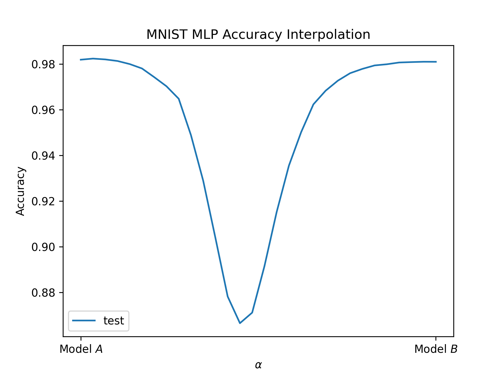
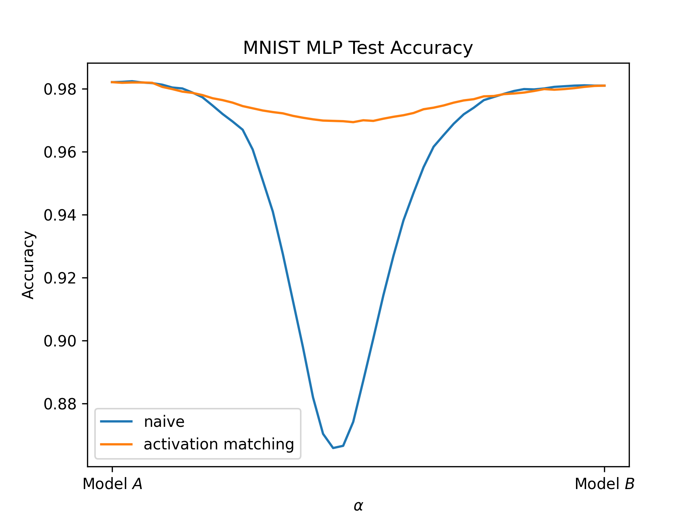

# rebasin

Replicating some experiments from the [Git Re-Basin paper](https://arxiv.org/pdf/2209.04836.pdf)

### Experiments

Below you can see one of the experiments motivating the paper. We train two models (Model A and Model B) on a dataset (here: MNIST) until convergence (~98% test accuracy). When we then linearly interpolate between the parameters of these two trained models we can see that the accuracy decreases towards $\alpha = 0.5$, i.e. where the parameters are most mixed.

While we can see that linear interpolation between parameters does not work by default, the paper suggests that there are certain permuations we can apply to parameters B to match them to the parameters of model A.

### Matching the weights

#### Activation matching

The first of the three proposed weight-matching algorithms works by matching the activations of the two models. After using this method to match the parameters of model B to those of A, we can see that interpolating between parameters A and the permuted parameters B works much better.

